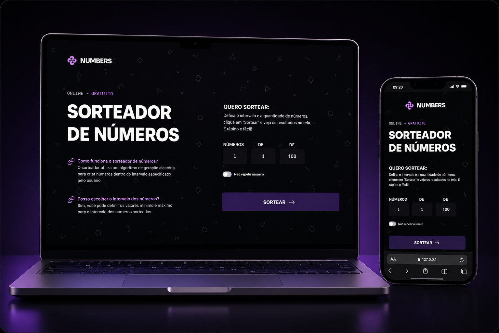

<h1 align="center">
  🎲 Numbers
</h1>

  <a href="#-o-projeto">O Projeto</a>&nbsp;&nbsp;&nbsp;|&nbsp;&nbsp;&nbsp;
  <a href="#-tecnologias">Tecnologias</a>&nbsp;&nbsp;&nbsp;|&nbsp;&nbsp;&nbsp;
  <a href="#-layout">Layout</a>

  

## 💻 O Projeto

**Numbers** é um sorteador de números online e gratuito. O usuário define quantos números quer sortear, o intervalo (de/até) e se quer permitir repetição entre os valores sorteados, e a aplicação exibe o resultado com uma pequena animação sequencial.

Os principais destaques do desenvolvimento incluem:

1. **Sorteio sem repetição:** a função `drawNumber` valida se o intervalo escolhido comporta a quantidade de números pedida quando a opção "não repetir" está ativa, evitando loops infinitos e alertando o usuário quando o sorteio é matematicamente impossível.
2. **Resultado animado em sequência:** cada número sorteado é inserido no DOM com um pequeno delay entre eles (via `setTimeout`), criando um efeito de revelação progressiva em vez de mostrar todos os resultados de uma vez.
3. **Troca de telas sem reload:** o formulário e a tela de resultado alternam de visibilidade via classes CSS, mantendo a aplicação em uma única página e sem recarregar ao enviar (`event.preventDefault()`).
4. **Design tokens em CSS puro:** cores, gradientes e tipografia são centralizados em `custom properties` no `:root`, com uso de **CSS nesting nativo** para organizar os seletores por componente sem precisar de pré-processador.

## 🚀 Tecnologias

* **HTML5:** Estruturação semântica da página, incluindo formulário acessível com `label` associado a cada `input`.
* **CSS3:** Estilização com variáveis de design (cores, gradientes e escalas tipográficas), nesting nativo de seletores e efeitos de borda em gradiente nos campos de input.
* **JavaScript:** Manipulação do DOM, captura de eventos do formulário, lógica de sorteio aleatório com `Math.random()` e animação sequencial dos resultados com `setTimeout`.
* **Git & GitHub:** Versionamento e deploy da aplicação.
* **Figma**

## 🔖 Layout

Você pode visualizar e interagir com o projeto através dos links abaixo:

* 📲 **[Acesse o layout original do projeto aqui](https://www.figma.com/community/file/1397279380752780744)**
* 👉 **[Acesse o site funcionando aqui](https://alissonfa.github.io/numbers/)**

**Para rodar no seu computador (Local):**
1. Faça o download ou clone o repositório.
2. Certifique-se de que a estrutura de pastas está correta.
3. Dê um duplo clique no arquivo `index.html` ou abra através da extensão *Live Server* no seu editor de código.

---

Feito com 💜 por **[AlissonFA](https://www.linkedin.com/in/alissonfa/)**